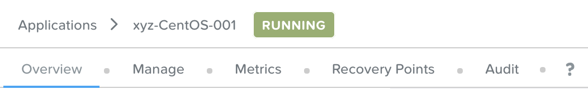

.. _calm_iaas_linux:

---------------------------------
Calm: LinuxによるInfrastructure as a Service構築
---------------------------------

*この演習の所要時間は約60分です。*

はじめに
++++++++

Nutanix Calmを使用すると、プライベートクラウドとパブリッククラウドの両方のインフラストラクチャにわたって、ビジネスアプリケーションをシームレスに選択、プロビジョニング、管理することができます。Nutanix Calmは、アプリのライフサイクル、モニタリング、および運用をVMやベアメタルサーバーなどの異なるインフラストラクチャにおいて提供します。Nutanix Calmは複数のプラットフォームをサポートしているため、単一のセルフサービスおよび自動化インターフェースを使用してすべてのインフラストラクチャを管理することができます。

Infrastructure-as-a-Service(IaaS)は、セルフサービスポータルを介してオンデマンドでリソースを迅速に提供する機能として定義されています。 現在、Nutanix Calmのユーザの大部分は、エンドユーザーに基本的なIaaS機能を提供するためにCalmを利用しています。一方、複雑で多階層のアプリケーションをオーケストレーションするためにNutanix Calmを利用するユーザもいます。

**このラボでは、Linuxベースの"単一の仮想マシンのブループリント"を作成し、ブループリントを起動し、結果として得られた仮想マシンおよびアプリケーションを管理します。**

単一の仮想マシンのブループリントの作成
++++++++++++++++++++++++++++++

ブループリントとは、Nutanix Calmを使用してモデル化するすべてのアプリケーションまたはインフラストラクチャのフレームワークです。 複雑で多階層のアプリケーションは「マルチ仮想マシン/ポッド ブループリント」を利用しますが、「単一の仮想マシンのブループリント」のインターフェースはIaaSのユースケースにおいて利用可能です。 あなたの会社が利用しているインフラストラクチャの各タイプ（例えばWindows、CentOS、Ubuntuなど）を単一の仮想マシンのブループリントでモデル化することができ、エンドユーザーは必要に応じて繰り返しブループリントを起動してインフラストラクチャを作成することができます。結果として得られたインフラストラクチャ（「アプリケーション」と呼ばれています）は、Nutanix Guest Tools (NGT)の管理、リソースの変更、スナップショット、およびクローン作成を含めて、Calm内でライフサイクル全体を通して管理することができます。

このラボでは、**CentOS7** のLinuxサーバを作成します。

#. **Prism Central** で、 :fa:`bars` **> サービス > Calm** を選択します。

   .. figure:: images/1_access_calm.png

#. 左側のツールバーの **Blueprints** を選択して、Calmのブループリントを表示および管理します。

   .. note::

     アイコンにマウスを当てるとメニューがテキストで表示されます。

#. `こちら <https://github.com/shocnt/CalmIaaS_Bootcamp/raw/master/calm_linux_track/calm_iaas_linux/Single-CentOS7-AHV.json>`_ からテンプレートとなるブループリントをローカルマシンにダウンロードします。(ブラウザの機能においてファイルを別名ダウンロードしてください。)

#. **ブループリントのアップロード** をクリックし、ダウンロードしたjsonファイル(Single-CentOS7-AHV.json)を選択します。

#. 以下の項目を記入します。

   - **ブループリント名** - *あなたのイニシャル*-CentOS-IaaS
   - **プロジェクト** - *あなたのイニシャル*-Project

#. 以下の項目を記入します。

   - **説明** - ブループリントの説明を書きます。(任意)
   - **プロジェクト** - *あなたのイニシャル*-Project(変更なし)
   - **環境** - *あなたのイニシャル*-Environment

   .. figure:: images/new_2_centos_1.png
       :align: center
       :alt: CentOS 7 Blueprint Settings

       CentOS 7のブループリント設定

#. **仮想マシンの詳細** をクリックし、次のステップに進みます。

#. **仮想マシンの詳細** ページでは、以下のフィールドを入力します。

   - **名前** - Calm内部で用いる仮想マシン名。 デフォルトのままにしておくことができます。
   - **アカウント** - 仮想マシンの展開先となるプラットフォーム。 **NTNX_LOCAL_AZ** を設定します。
   - **オペレーティングシステム** - デプロイするOSの種類。Linuxのままにします。

   .. figure:: images/new_4_centos_2.png
       :align: center
       :alt: CentOS 7 VM Details

       CentOS 7の仮想マシンの詳細

#. **環境からクローン** をクリックします。これにより事前準備でプロジェクト内に作成した　**環境** で設定したLinux VMの設定をクローンします。

#. 次のステップに進むには、 **VM設定** をクリックします。

#. このページでは、インフラストラクチャの様々な設定を指定していきます。

   - **一般構成**

     - **VM名** - *あなたのイニシャル*-CentOS7-@@{calm_time}@@
     - **vCPUs** - 4 ( **走る人** のアイコンをクリックしてフィールドを **ランタイム** としてマークすると、青くなります。これにより、エンドユーザーはブループリント起動時にこのフィールドを変更することができます。)
     - **vCPUあたりのコア数** - 1
     - **メモリー (GiB)** - 6 (このフィールドを **ランタイム** としてマークします。)

     .. figure:: images/new_6_centos_3.png
         :align: center
         :alt: CentOS 7 VM Configuration - General Configuration

         CentOS 7のVM設定 - 一般構成

   - **ゲストのカスタマイズ** - ゲストのカスタマイズでは、起動時に特定の設定を変更することができます。Linux OSでは「Cloud Init」、Windows OSでは「Sysprep」を使用します。 **ゲストのカスタマイズ** を選択し、以下のスクリプトを貼り付けます。

       .. literalinclude:: cloud-init.sh
          :language: bash

       .. figure:: images/new_8_centos_4.png
           :align: center
           :alt: CentOS 7 Cloud Init

           CentOS 7のCloud Init

     .. note::
        "@@{VM_CENTOS}@@"の文字に注意してください。Calm では、"@@{}@@"文字はマクロを表します。実行時には、マクロに遭遇した場合、Calmは自動的にマクロを適切な値に置き換えます。マクロは、システムで定義された値、VMプロパティ、認証情報または変数を表すことができます。このラボでは後ほど、"VM_ADMIN "という名前の認証情報を作成します。
        
   - **ディスク** - ディスクは、デプロイするVMやインフラストラクチャのストレージです。既存のイメージをベースにしている場合もあれば、VMが追加のストレージを利用できるように空のディスクをベースにしている場合もあります。例えば、Microsoft SQLサーバーでは、ベース OSのディスク、SQL Serverのバイナリディスク、データベースデータファイルディスク、TempDB ディスク、ロギングディスクが必要になるかもしれません。本演習では、既存のイメージをベースにした単一のディスクを使用します。

     - **タイプ** - ディスクの種類、これはデフォルトのままにします( **DISK** )。
     - **バスタイプ** - ディスクのバスタイプ、これはデフォルトのままにします( **SCSI** )。
     - **オペレーション** - ディスクがどのように提供されるか。"Allocate on Storage Container"は空のディスクを追加するために使用します。本演習では事前に定義された仮想マシンイメージを使用しているので、デフォルトの **Clone from Image Service** のままにしておきます。
     - **Image** - 仮想マシンのベースとなるイメージ。 **CentOS7.qcow2** を選択します。
     - **ブート可能な** - このディスクによりオペレーティングシステムを起動可能かどうか。最低でも1つのディスクがブート可能でなければなりません。ここではチェック済のままにしておきます。

     .. figure:: images/10_centos_5.png
         :align: center
         :alt: CentOS 7 VM Configuration - Disks

         CentOS 7のVM設定 - ディスク

   - **ブート設定** - VMの起動方法です。デフォルトの **Legacy BIOS** のままにしておきます。

   - **vGPUs** - VMにGPUが必要かどうか。 デフォルトのnoneのままにしておきます。

   - **カテゴリ** - カテゴリは、Nutanixのポートフォリオ内のいくつかの異なる製品とソリューションにまたがって利用されます。これらにより、セキュリティポリシー、保護ポリシー、アラートポリシー、およびプレイブックを適用するための属性データとしてのカテゴリを付与することができます。 ワークロードに対応するカテゴリを選択するだけで、これらすべてのポリシーが自動的に適用されます。しかし、このラボでは、このフィールドは **空白** のままにしておきます。

   .. figure:: images/12_boot_gpu_cat.png
       :align: center
       :alt: VM Configuration - Boot Configuration, vGPUs, and Categories

       VM設定 - Boot設定, vGPU, カテゴリ

   - **NICs** - ネットワークアダプタを使用すると、仮想マシンとの通信が可能になります。 **青色の+** をクリックし、ドロップダウンで **Primary** を選択し、 **動的** ラジオボタンを選択して、1つのNICを追加します。

   .. figure:: images/13_vm_nic.png
       :align: center
       :alt: VM Configuration - NICs

       VM Configuration - NICs

   - **シリアルポート** - VMに仮想シリアルポートが必要かどうか。デフォルトの **none** のままにしておきます。

   .. figure:: images/14_serial.png
       :align: center
       :alt: VM Configuration - Serial Ports

       VM Configuration - シリアルポート

#. ページの下部にある青い **保存** ボタンをクリックします。ゲストのカスタマイズに"VM_CENTOS"という未定義のマクロが含まれているため、不正なマクロに関する警告が1つ発生していることが予想されます。追加の警告やエラーがある場合は、次のセクションに進む前に必ず解決してください。

   .. figure:: images/new_15_centos_error.png
       :align: center
       :alt: Blueprint Save - Error

       Blueprint Save - エラー

認証情報を定義する
++++++++++++++++++

認証情報を定義することで、仮想マシン作成後の接続確認、リモートアクセスをして各種OS設定、パッケージのインストール等の自動化が可能となります。

認証情報も、 **@@{認証情報名}@@** という文字列（マクロと呼ばれる）を使用してオブジェクトに対して実行されるスクリプトで使用することができます。Calmは、仮想マシンに送信する前に認証情報を展開して適切な値に置き換えます。ここではブループリント内で定義した、centosユーザのログインパスワード **VM_CENTOS** を定義します。また、VM_CENTOSのパスワードについてユーザが自由に入力出来るようにします。

#. **④詳細オプション(任意)** メニューをクリックすると、メニューが表示されます。

#. **認証情報の追加/編集** をクリックします。

#. 表示されたポップアップでは、現在認証情報が設定されていないことが表示されるはずです。先に進み、青い **+ 認証情報の追加** ボタンをクリックして認証情報を追加し、以下のフィールドに記入してください。

   - メインペインで、変数 **認証情報名** を **VM_CENTOS** に設定します。この名前は、仮想マシンのカスタマイズスクリプトのマクロ内の値と正確に一致しなければなりません（大文字小文字を含めて）。
   - **ユーザ名** は **centos** とします。
   - **秘密のタイプ** は、 **パスワード** とします。
   - **パスワード** は、好きなパスワードを入力します。
   - パスワードボックスの上部の **走る人** をクリックし、この認証情報を **ランタイム** と設定します。
   - **デフォルトとして使用** にチェックを入れます。

     .. figure:: images/new_17_centos_credentials.png
         :align: center
         :alt: Credentials

         認証情報

#. 青い **完了** ボタンをクリックします。

#. **保存** ボタンをクリックします。警告が消えれば正常です。

ブループリントの起動
+++++++++++++++++++++++

ブループリントが完成しましたが、保存ボタンの右側にあるボタンについて説明します。

- **公開** - マーケットプレイスへのブループリントの公開を要求することができます。ブループリントはプロジェクトと1:1のマッピングを持っているので、自分のプロジェクトのメンバーである他のユーザーだけがこのブループリントを起動することができます。しかし、ブループリントをマーケットプレイスに公開することで、管理者は作成したブループリントを複数プロジェクトのユーザに対して割り当てることができ、複数プロジェクトのエンドユーザーにセルフサービスを提供することができます。
- **ダウンロード** - このオプションは、ブループリントをJSON形式でダウンロードし、ソースコントロールシステムにチェックインしたり、別のCalmインスタンスにアップロードしたりすることができます。
- **起動** - これはブループリントを起動し、私たちのアプリケーションや仮想マシンをデプロイします。

#. **起動** ボタンをクリックして、以下のように入力してください。

    - **アプリケーションの名前** - *あなたのイニシャル*-CentOS-IaaS
    - **vm_password** - Nutanix/4u

   .. figure:: images/18_launch.png
       :align: center
       :alt: Blueprint Launch

       ブループリントの起動

#. **作成** をクリックすると、アプリケーションのページが表示されます。

アプリケーションの管理
+++++++++++++++++++++++++

アプリケーションが **プロビジョニング** 状態から **実行中** 状態に変わるまで数分待ちます。 **エラー** 状態に変わった場合は、 **監査** タブに移動し、 **作成** アクションを展開して、問題のトラブルシューティングを開始します。

アプリケーションが **実行中** の状態になったら、UI上部のタブを見ていきます。

    アプリケーションタブ

- **概要** タブでは、指定された変数、発生したコスト（ショーバックはCALM設定で設定可能）、アプリケーションサマリー、および仮想マシンのサマリーについての情報が表示されます。
- **管理** タブでは、アプリケーション/インフラストラクチャに対するアクションを実行できます。 これには、基本的なライフサイクル（起動、再起動、停止、削除）、NGT管理（インストール、管理、アンインストール）、および基本的なVMリソースの編集を可能にする仮想マシンの更新が含まれます。
- **評価指標** タブでは、CPU、メモリ、ストレージ、ネットワークの使用率に関する詳細な情報を提供します。
- **リカバリーポイント** タブには、VMスナップショットの履歴が表示され、ユーザーはこれらのポイントのいずれかにVMをリストアすることができます。
- **監査** タブには、アプリケーションに対して実行されたすべてのアクション、アクションを実行した時間とユーザー、スクリプトの出力を含むアクションの結果に関する詳細な情報が表示されます。

次に、UIの右上で利用できる共通のVMタスクを表示します。

    アプリケーションボタン

- **クローン** ボタンを使用すると、既存のアプリケーションを、現在のアプリケーションとは別に管理可能な新しいアプリケーションに複製することができます。これはブループリントを再度起動することと同じです。
- **スナップショット** ボタンをクリックすると、VMの新しいリカバリポイントが作成され、VMをリストアすることができます。
- **コンソールを起動** ボタンを押すと、VMのコンソールウィンドウが開きます。
- **更新** ボタンをクリックすると、エンドユーザーは基本的なVM設定を変更することができます（これは **管理 > 仮想マシンの更新** アクションと同等です）。
- **削除** ボタンをクリックすると、基礎となるVMとCalmアプリケーションが削除されます（これは、 **Manage > App Delete** アクションと同等です）。

アプリケーションのページレイアウトに慣れてきたところで、メモリを追加して仮想マシンを更新していきたいですが、何かあったときにリカバリーできるような方法でやっていきましょう。

#. 右上の **スナップショット** ボタンをクリックし、表示されたポップアップに次のように入力します。

   - **スナップショット名** - before-update-@@{calm_time}@@ (他のオプションはデフォルトのままにします。)

   .. figure:: images/21_snapshot.png
       :align: center
       :alt: Application Snapshot

       アプリケーションのスナップショット

#. **保存** をクリックします。

#. **監査** タブにリダイレクトされていることに注意してください。 **スナップショット作成** アクションを展開して、スナップショットのタスクを表示します。 完了したら、 **リカバリーポイント** タブに移動し、新しいスナップショットがリストされていることを確認します。

#. 次に、右上の **コンソールを起動** ボタンをクリックし、仮想マシンにログインします。

   - **Username** - centos
   - **Password** - Nutanix/4u

#. CentOS上で現在のメモリを表示するには、 **free -h** コマンドを実行します。VMに割り当てられた現在のメモリをメモしておきます。

   .. figure:: images/22_centos_memory_before.png
       :align: center
       :alt: CentOS Memory - Before Update

       CentOS メモリ - 更新前

#. Calmのアプリケーションページに戻り、右上の **更新** メニューの **仮想マシン設定の更新** ボタンをクリックします。表示されたページで、 **メモリ(GiB)** フィールドを2GiB(CentOSの場合は6GiBと入力します。)増やします。

#. 右下の青い **更新** ボタンをクリックします。

#. メモリフィールドが2GiB増加したことを確認し、 **確認** をクリックします。

   .. figure:: images/24_centos_confirm.png
       :align: center
       :alt: CentOS Memory - Confirm Change

       CentOS メモリ - 更新の確認

#. Calmの **監査** タブで、 **アプリの更新** アクションが完了するのを待ちます。

#. **仮想マシンのコンソール** に戻って、先ほどと同じコマンドを実行して、更新されたメモリを表示し、2GiB増加していることに注意してください。

   .. figure:: images/26_centos_memory_after.png
       :align: center
       :alt: CentOS Memory - After Update

       CentOS メモリ - 更新後

仮想マシンの更新で何か問題が発生した場合は、 **リカバリーポイント** タブに移動し、先ほど取得した **before-update** スナップショットの **リストア** をクリックし、ポップアップで **確認** をクリックします。

ブループリントをマーケットプレイスに追加する
+++++++++++++++++++++++++++++++++++++++++

ここではブループリントをマーケットプレイスに公開します。

ブループリントの公開
........................

#. 左側のツールバーで、 **ブループリント** をクリックし、Calmのブループリントを表示します。

#. **あなたのイニシャル-CentOS-IaaS** のブループリントをクリックしてください。

#. **公開** ボタンをクリックして、以下のように入力します。

   - **名前** - あなたのイニシャル_CentOS_IaaS
   - **シークレットとともにパブリッシュ** - オフ
   - **初期バージョン** - 1.0.0
   - **説明** - 任意

   .. figure:: images/28_centos_publish_bp.png
       :align: center
       :alt: CentOS Publish Blueprint

       CentOS ブループリントの公開

#. **承認用に送信** をクリックします。

   .. note::

     シークレットとともにパブリッシュ: デフォルトでは、ブループリントの認証情報は公開されたブループリントにおいて保存されません。その結果、マーケットプレイスアイテムの起動時に、認証情報は環境から入力されるか、ユーザーが埋めなければなりません。この動作を望まず、認証情報をそのまま保存したい場合は、このフラグを設定してください。

ブループリントの承認
....................

#. 左側のツールバーで、 **Marketplace Manager** をクリックし、マーケットプレイスのアイテムを表示します。

#. マーケットプレイスのブループリントとそのバージョンのリストが表示されます。ページ上部の **承認を保留** を選択します。

#. あなたのイニシャル_CentOS_IaaS ブループリントを表示します。

#. 利用可能なアクションを確認します。

   - **承認** - マーケットプレイスに公開するためのブループリントを承認します。
   - **拒否** - ブループリントがマーケットプレイスで公開されないようにします。ブループリントを公開するには、拒否された後に再度提出する必要があります。
   - **削除** - マーケットプレイスへのブループリントの提出を削除します。
   - **起動** - ブループリントエディタから起動するのと同様に、アプリケーションとしてブループリントを起動します。

#. 利用可能な選択肢を確認します。

   - **カテゴリ** - 新しいマーケットプレイスのブループリントのカテゴリを更新することができます。
   - **共有するプロジェクト** - マーケットプレイスのブループリントを特定のプロジェクトでのみ利用できるようにします。

#. **承認** をクリックします。

   .. figure:: images/29_centos_approve_bp.png
       :align: center
       :alt: CentOS Approve Blueprint

       CentOSブループリントの承認

#. ページの上部にある **マーケットプレイスブループリント** を選択し、検索バーにあなたの *イニシャル* を入力してください。あなたのブループリントが **認められた** のステータスで表示されているはずです。

   .. figure:: images/30_centos_marketplace_bp.png
       :align: center
       :alt: CentOS Marketplace Blueprint

       CentOS マーケットプレイスブループリント

#. まだこの状態ではブループリントが公開可能になったのみで、マーケットプレイスへの公開を行う必要があります。下のように設定し、 **適用** をクリックします。

   - **カテゴリ** - DevOps
   - **共有するプロジェクト** - *あなたのイニシャル*-プロジェクト
   
#. **公開** をクリックし、マーケットプレイスにブループリントを公開します。

   .. figure:: images/publish.png
       :align: center
       :alt: CentOS Marketplace Blueprint

       CentOS マーケットプレイスブループリントの公開
       
#. あなたのブループリントが **公開された** のステータスで表示されているはずです。

   .. figure:: images/published.png
       :align: center
       :alt: CentOS Marketplace Blueprint

       CentOS マーケットプレイスブループリント

#. 左側のツールバーで、 **Marketplace** をクリックし、マーケットプレイスに公開されたアイテムを表示します。

   .. figure:: images/mktitem.png
       :align: center
       :alt: Marketplace

       マーケットプレイス

マーケットプレイスからブループリントを起動する
+++++++++++++++++++++++++++++++++++++++++++++

マーケットプレイスからブループリントを立ち上げる
............................................

#. 左側のメニューから **Marketplace** をクリックします。

#. **あなたのイニシャル_CentOS_IaaS** ブループリントを選択し、マーケットプレイスから **起動** をクリックします。

   .. figure:: images/mktlaunch.png
       :align: center
       :alt: CentOS Marketplace Launce Blueprint

       CentOS マーケットプレイスからのブループリントの起動

#. *あなたのイニシャル*-Projectのプロジェクトを選択し、 **起動** をクリックします。

#. 以下の情報を入力し、 **作成** ボタンをクリックします。

   - **アプリケーション名** - *あなたのイニシャル*-CentOS-IaaS-Mkt
   - **vm_password** - Nutanix/4u

#. ブループリントのプロビジョニングを完了するまで監視します。

終わりに
+++++++++

**Nutanix Calm** と **単一の仮想マシンのブループリント** について知っておくべき重要なことは何ですか？

- Nutanix Calmは、アプリケーションとインフラストラクチャの自動化をPrism内でネイティブに提供し、複雑で1週間にも及ぶチケッティングプロセスをワンクリックのセルフサービスプロビジョニングに変えます。

- 複数の仮想マシンのブループリントが複雑な多階層アプリケーションのプロビジョニングとライフサイクル管理を可能にするのに対し、単一の仮想マシンのブループリントは、IT部門がエンドユーザにInfrastructure-as-a-Serviceを提供することを可能にします。

- スナップショット、リストア、クローニング、インフラストラクチャの更新など、一般的な運用上の操作はすべて、エンドユーザがCalm内で直接行うことができます。

.. |proj-icon| image:: ../images/projects_icon.png
.. |mktmgr-icon| image:: ../images/marketplacemanager_icon.png
.. |mkt-icon| image:: ../images/marketplace_icon.png
.. |bp-icon| image:: ../images/blueprints_icon.png
.. |blueprints| image:: images/blueprints.png
.. |applications| image:: images/blueprints.png
.. |projects| image:: images/projects.png
