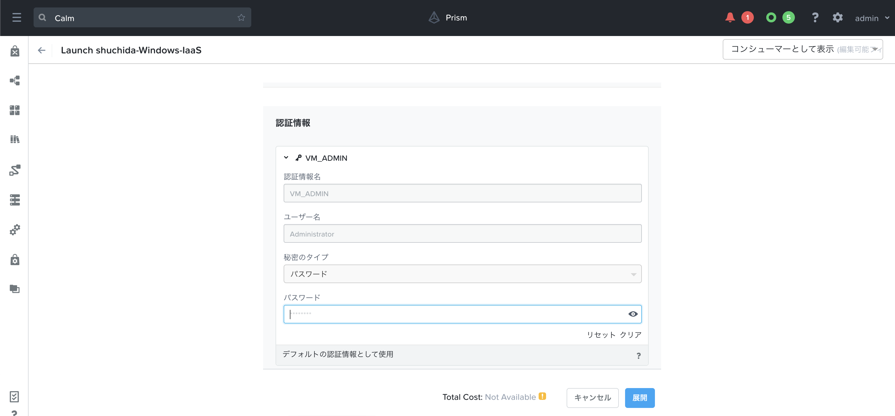
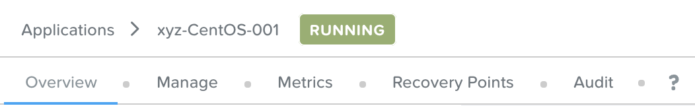

.. _calm_iaas_windows:

---------------------------------
Calm: WindowsによるInfrastructure as a Service構築
---------------------------------

*この演習の所要時間は約20分です。*

はじめに
++++++++

Nutanix Calmを使用すると、プライベートクラウドとパブリッククラウドの両方のインフラストラクチャにわたって、ビジネスアプリケーションをシームレスに選択、プロビジョニング、管理することができます。Nutanix Calmは、アプリのライフサイクル、モニタリング、および運用をVMやベアメタルサーバーなどの異なるインフラストラクチャにおいて提供します。Nutanix Calmは複数のプラットフォームをサポートしているため、単一のセルフサービスおよび自動化インターフェースを使用してすべてのインフラストラクチャを管理することができます。

Infrastructure-as-a-Service(IaaS)は、セルフサービスポータルを介してオンデマンドでリソースを迅速に提供する機能として定義されています。 現在、Nutanix Calmのユーザの大部分は、エンドユーザーに基本的なIaaS機能を提供するためにCalmを利用しています。一方、複雑で多階層のアプリケーションをオーケストレーションするためにNutanix Calmを利用するユーザもいます。

**このラボでは、Windowsベースの"単一の仮想マシンのブループリント"を作成し、ブループリントを起動し、結果として得られた仮想マシンおよびアプリケーションを管理します。**

単一の仮想マシンのブループリントの作成
++++++++++++++++++++++++++++++

ブループリントとは、Nutanix Calmを使用してモデル化するすべてのアプリケーションまたはインフラストラクチャのフレームワークです。 複雑で多階層のアプリケーションは「マルチ仮想マシン/ポッド ブループリント」を利用しますが、「単一の仮想マシンのブループリント」のインターフェースはIaaSのユースケースにおいて利用可能です。 あなたの会社が利用しているインフラストラクチャの各タイプ（例えばWindows、CentOS、Ubuntuなど）を単一の仮想マシンのブループリントでモデル化することができ、エンドユーザーは必要に応じて繰り返しブループリントを起動してインフラストラクチャを作成することができます。結果として得られたインフラストラクチャ（「アプリケーション」と呼ばれています）は、Nutanix Guest Tools (NGT)の管理、リソースの変更、スナップショット、およびクローン作成を含めて、Calm内でライフサイクル全体を通して管理することができます。

このラボでは、**Windows Server 2016** のサーバを作成します。

#. **Prism Central** で、 :fa:`bars` **> サービス > Calm** を選択します。

   .. figure:: images/1_access_calm.png

#. 左側のツールバーの **Blueprints** を選択して、Calmのブループリントを表示および管理します。

   .. note::

     アイコンにマウスを当てるとメニューがテキストで表示されます。

#. `こちら <https://github.com/shocnt/CalmIaaS_Bootcamp/raw/master/calm_windows_track/calm_iaas_windows/Single-Windows2016-AHV.json>`_ からテンプレートとなるブループリントをローカルマシンにダウンロードします。(ブラウザの機能においてファイルを別名ダウンロードしてください。)

#. **ブループリントのアップロード** をクリックし、ダウンロードしたjsonファイル(Single-Windows2016-AHV.json)を選択します。

#. 以下の項目を記入します。

   - **ブループリント名** - *あなたのイニシャル*-Windows-IaaS
   - **プロジェクト** - *あなたのイニシャル*-Project

#. 以下の項目を記入します。

   - **説明** - ブループリントの説明を書きます。(任意)
   - **プロジェクト** - *あなたのイニシャル*-Project(変更なし)
   - **環境** - プロジェクトのすべてのアカウント

   .. figure:: images/new_3_windows_1.png
       :align: center
       :alt: Windows 2016 Blueprint Settings

       Windows 2016 ブループリント設定

#. **仮想マシンの詳細** をクリックし、次のステップに進みます。

#. **仮想マシンの詳細** ページでは、以下のフィールドを入力します。

   - **名前** - Calm内部で用いる仮想マシン名。 デフォルトのままにしておくことができます。
   - **アカウント** - 仮想マシンの展開先となるプラットフォーム。 **NTNX_LOCAL_AZ** を設定します。
   - **オペレーティングシステム** - デプロイするOSの種類。Windowsを設定します。

   .. figure:: images/new_5_windows_2.png
       :align: center
       :alt: Windows 2016 VM Details

       Windows 2016 仮想マシンの詳細

#. 次のステップに進むには、 **VM設定** をクリックします。

#. このページでは、インフラストラクチャの様々な設定を指定していきます。

   - **一般構成**

     - **VM名** - ハイパーバイザー/クラウドに応じた仮想マシンの名前です。デフォルトのままでも構いません。
     - **vCPUs** - 4 ( **走る人** のアイコンをクリックしてフィールドを **ランタイム** としてマークすると、青くなります。これにより、エンドユーザーはブループリント起動時にこのフィールドを変更することができます。)
     - **vCPUあたりのコア数** - 1
     - **メモリー (GiB)** - 6 (このフィールドも **ランタイム** としてマークします。)

     .. figure:: images/7_windows_3.png
         :align: center
         :alt: Windows 2016 VM Configuration - General Configuration

         Windows 2016のVM設定 - 一般構成

   - **ゲストのカスタマイズ** - ゲストのカスタマイズでは、起動時に特定の設定を変更することができます。Linux OSでは「Cloud Init」、Windows OSでは「Sysprep」を使用します。 **ゲストのカスタマイズ** を選択し、以下のスクリプトを貼り付けます。インストールタイプ(Prepared)はデフォルトのままにしておきます。

     - Windows 2016

       .. literalinclude:: sysprep.xml
          :language: xml

       .. figure:: images/9_windows_4.png
           :align: center
           :alt: Windows 2016 Sysprep

           Windows 2016 Sysprep

     .. note::
        "@@{VM_ADMIN}@@"の文字に注意してください。Calm では、"@@{}@@"文字はマクロを表します。実行時には、マクロに遭遇した場合、Calmは自動的にマクロを適切な値に置き換えます。マクロは、システムで定義された値、VMプロパティ、認証情報または変数を表すことができます。このラボでは後ほど、"VM_ADMIN "という名前の認証情報を作成します。

     - **ドメインに参加** - ドメインに参加にチェックを付け、以下を入力します。再びマクロを入力します。
     
       - **ドメイン名** - @@{AD_DOMAIN}@@
       - **認証情報** - 一旦空白とし、後ほど入力します
       - **DNS IP** - @@{DC_IP}@@

       .. figure:: images/new_9_windows_4-2.png
           :align: center
           :alt: Windows 2016 Domain

           Windows 2016 Domain

   - **ディスク** - ディスクは、デプロイするVMやインフラストラクチャのストレージです。既存のイメージをベースにしている場合もあれば、VMが追加のストレージを利用できるように空のディスクをベースにしている場合もあります。例えば、Microsoft SQLサーバーでは、ベース OSのディスク、SQL Serverのバイナリディスク、データベースデータファイルディスク、TempDB ディスク、ロギングディスクが必要になるかもしれません。本演習では、既存のイメージをベースにした単一のディスクを使用します。

     - **タイプ** - ディスクの種類、これはデフォルトのままにします( **DISK** )。
     - **バスタイプ** - ディスクのバスタイプ、これはデフォルトのままにします( **SCSI** )。
     - **オペレーション** - ディスクがどのように提供されるか。"Allocate on Storage Container"は空のディスクを追加するために使用します。本演習では事前に定義された仮想マシンイメージを使用しているので、デフォルトの **Clone from Image Service** のままにしておきます。
     - **Image** - 仮想マシンのベースとなるイメージ。 **Windows2016.qcow2** を選択します。
     - **ブート可能な** - このディスクによりオペレーティングシステムを起動可能かどうか。最低でも1つのディスクがブート可能でなければなりません。ここではチェック済のままにしておきます。

     .. figure:: images/11_windows_5.png
         :align: center
         :alt: Windows 2016 VM Configuration - Disks

         Windows 2016のVM設定 - ディスク

   - **ブート設定** - VMの起動方法です。デフォルトの **Legacy BIOS** のままにしておきます。

   - **vGPUs** - VMにGPUが必要かどうか。 デフォルトのnoneのままにしておきます。

   - **カテゴリ** - カテゴリは、Nutanixのポートフォリオ内のいくつかの異なる製品とソリューションにまたがって利用されます。これらにより、セキュリティポリシー、保護ポリシー、アラートポリシー、およびプレイブックを適用するための属性データとしてのカテゴリを付与することができます。 ワークロードに対応するカテゴリを選択するだけで、これらすべてのポリシーが自動的に適用されます。しかし、このラボでは、このフィールドは **空白** のままにしておきます。

   .. figure:: images/12_boot_gpu_cat.png
       :align: center
       :alt: VM Configuration - Boot Configuration, vGPUs, and Categories

       VM設定 - Boot設定, vGPU, カテゴリ

   - **NICs** - ネットワークアダプタを使用すると、仮想マシンとの通信が可能になります。 **青色の+** をクリックし、ドロップダウンで **Primary** を選択し、 **動的** ラジオボタンを選択して、1つのNICを追加します。

   .. figure:: images/13_vm_nic.png
       :align: center
       :alt: VM Configuration - NICs

       VM Configuration - NICs

   - **シリアルポート** - VMに仮想シリアルポートが必要かどうか。デフォルトの **none** のままにしておきます。

   .. figure:: images/14_serial.png
       :align: center
       :alt: VM Configuration - Serial Ports

       VM Configuration - シリアルポート

#. ページの下部にある青い **保存** ボタンをクリックします。ドメインの認証情報が空白になっていること、VM_ADMINが定義されていない旨のエラーが2つ出力されていれば正常です。追加のエラーや警告がある場合は、次のセクションに進む前に必ず解決してください。

   .. figure:: images/new_15_error.png
       :align: center
       :alt: Blueprint Save - Error

       Blueprint Save - エラー

変数を定義する
++++++++++++++++++

変数は、ブループリントの拡張性を向上します。つまり、1つのブループリントを、その変数の設定に応じて複数の目的や環境で使用することができます。変数は、ブループリントの一部として保存された静的な値か、 **ランタイム** （ブループリントの起動時）に指定することができます。

単一の仮想マシンのブループリントでは、上部にある **アプリ変数** ボタンをクリックすると、変数にアクセスできます。デフォルトでは、変数は **文字列** として保存されますが、別の **データ型** (整数、複数行の文字列、日付、時刻、および日付時刻)を使用することもできます。これらのデータ型のいずれも、オプションで **秘匿情報** として設定することができます。また、より高度な **入力方法** もありますが、この演習の範囲外です。

変数は、 **@@{変数名}@@** という文字列（マクロと呼ばれる）を使用してオブジェクトに対して実行されるスクリプトで使用することができます。Calmは、仮想マシンに送信する前に変数を展開して適切な値に置き換えます。ここではブループリント内で定義した **AD_DOMAIN** と **DC_IP** を定義します。またこれらの値はユーザが勝手に書き換えることがないよう、プライベート変数として定義します。

#. 上部ペインの **アプリ変数** ボタンをクリックすると、変数メニューが表示されます。

#. 表示されたポップアップでは、現在変数が設定されていないことが表示されるはずです。先に進み、青い **+ 変数の追加** ボタンをクリックして変数を追加し、以下のフィールドに記入してください。

   - メインペインで、変数 **名前** を **AD_DOMAIN** に設定します。 この名前は、仮想マシンのカスタマイズスクリプトのマクロ内の値と正確に一致しなければなりません（大文字小文字を含めて）。
   - **データのタイプ** はデフォルトの **String** のままにしてください。他のオプションについてはこの演習の範囲外です。
   - **値** は、 **ntnxlab.local** と入力します。
   - **追加オプションの表示** をクリックします。
   - **この変数をプライベートとしてマーク** のチェックボックスをチェックします。これによりこの変数を勝手に書き換えることが出来なくなります。
   - 他のチェックボックスは非チェックのままにしておきます。

     .. figure:: images/new_16_variable_1.png
         :align: center
         :alt: Variable - AD_DOMAIN

         変数 - AD_DOMAIN

#. 青い **+ 変数の追加** ボタンを再びクリックして変数を追加し、以下のフィールドに記入してください。

   - メインペインで、変数 **名前** を **DC_IP** に設定します。 この名前は、仮想マシンのカスタマイズスクリプトのマクロ内の値と正確に一致しなければなりません（大文字小文字を含めて）。
   - **データのタイプ** はデフォルトの **String** のままにしてください。他のオプションについてはこの演習の範囲外です。
   - **値** は、 事前に配布されたドメインコントローラのIPアドレスを入力します。
   - **追加オプションの表示** をクリックします。
   - **この変数をプライベートとしてマーク** のチェックボックスをチェックします。これによりこの変数を勝手に書き換えることが出来なくなります。
   - 他のチェックボックスは非チェックのままにしておきます。

     .. figure:: images/new_16_variable_2.png
         :align: center
         :alt: Variable - DC_IP

         変数 - DC_IP

#. 下までスクロールして、青い **完了** ボタンをクリックします。

#. **保存** をクリックします。前項のエラーから変化が無ければ正常です。

認証情報を定義する
++++++++++++++++++

認証情報を定義することで、仮想マシン作成後の接続確認、リモートアクセスをして各種OS設定、パッケージのインストール等の自動化が可能となります。

認証情報も、 **@@{認証情報名}@@** という文字列（マクロと呼ばれる）を使用してオブジェクトに対して実行されるスクリプトで使用することができます。Calmは、仮想マシンに送信する前に認証情報を展開して適切な値に置き換えます。ここではブループリント内で定義した、ローカルアドミンのログインパスワード **VM_ADMIN** と、後ほど用いるドメインコントローラのログインパスワード **AD_ADMIN** を定義します。また、VM_ADMINのパスワードについてユーザが入力出来るようにします。

#. **④詳細オプション(任意)** メニューをクリックすると、メニューが表示されます。

#. **認証情報の追加/編集** をクリックします。

#. 表示されたポップアップでは、現在認証情報が設定されていないことが表示されるはずです。先に進み、青い **+ 認証情報の追加** ボタンをクリックして認証情報を追加し、以下のフィールドに記入してください。

   - メインペインで、変数 **認証情報名** を **VM_ADMIN** に設定します。この名前は、仮想マシンのカスタマイズスクリプトのマクロ内の値と正確に一致しなければなりません（大文字小文字を含めて）。
   - **ユーザ名** は **Administrator** とします。
   - **秘密のタイプ** は、 **パスワード** とします。
   - **パスワード** は、好きなパスワードを入力します。
   - パスワードボックスの上部の **走る人** をクリックし、この認証情報を **ランタイム** と設定します。
   - **デフォルトとして使用** にチェックを入れます。

#. **+ 認証情報の追加** をクリックします。

   - メインペインで、変数 **認証情報名** を **AD_ADMIN** に設定します。
   - **ユーザ名** は **Administrator** とします。
   - **秘密のタイプ** は、 **パスワード** とします。
   - **パスワード** は、 **nutanix/4u** とします。

     .. figure:: images/new_17_credentials.png
         :align: center
         :alt: Credentials

         認証情報

#. 青い **完了** ボタンをクリックします。

仮想マシンへの接続確認を定義する
++++++++++++++++++

認証情報を使用して、仮想マシン作成後の接続確認を行います。

#. **接続** から **作成時ログインのチェック** にチェックを入れます。

#. **認証情報** は **VM_ADMIN** を選択します。

#. **遅延** のみ60秒に変更し、それ以外はデフォルト値に設定します。

     .. figure:: images/new_connection.png
         :align: center
         :alt: Variable - DC_IP

         変数 - DC_IP

#. **保存** をクリックします。1つのみエラーが残れば正常です。

     .. figure:: images/new_error.png
         :align: center
         :alt: Blueprint Save - Error
  
         Blueprint Save - エラー

#. **③VM設定** に戻り、 **ドメイン設定** の **認証情報** のドロップダウンで **AD_ADMIN** を選択します。 

　　　.. figure:: images/new_domain.png
         :align: center
         :alt: Windows 2016 Domain

         Windows 2016 Domain

#. **保存** をクリックします。エラーが解消されます。

仮想マシンへのパッケージインストール/アンインストール
++++++++++++++++++

Powershellを使用し、作成後の仮想マシンへのOS設定、ソフトウェアインストール、もしくは削除前の仮想マシンでもアクションを行う事が可能です。

ここでは簡単なPowershellをパッケージインストールに定義し、作成後の仮想マシンで実行します。また、パッケージアンインストールにドメインからの除去スクリプトを定義し、削除前の仮想マシンで実行します。

#. **④詳細オプション(任意)** メニューをクリックします。

#. **パッケージのインストール** メニューから **編集** をクリックします。

#. **+ タスクの追加** をクリックします。

#. 中央部で **タスク1** の部分をクリックすると、右側に編集ペインが出てきますので、以下入力します。

   - **タスク名** - **Hello** と入力します。
   - **タイプ** - **実行** を選択します。
   - **スクリプトタイプ** - **Powershell** を選択します。
   - **エンドポイント(オプション)** - 空白にするとデフォルトで作成した仮想マシンでPowershellを実行することになります。
   - **認証情報** - **VM_ADMIN** を選択します。
   - **スクリプト**

      .. literalinclude:: hello.ps1
        :language: powershell

#. **完了** をクリックします。

#. **パッケージのアンインストール** メニューから **編集** をクリックします。

#. **+ タスクの追加** をクリックします。

#. 中央部で **タスク1** の部分をクリックすると、右側に編集ペインが出てきますので、以下入力します。

   - **タスク名** - **Remove from Domain** と入力します。
   - **タイプ** - **実行** を選択します。
   - **スクリプトタイプ** - **Powershell** を選択します。
   - **エンドポイント(オプション)** - 空白にするとデフォルトで作成した仮想マシンでPowershellを実行することになります。
   - **認証情報** - **VM_ADMIN** を選択します。
   - **スクリプト**

      .. literalinclude:: removeDomain.ps1
        :language: powershell

#. **完了** をクリックします。

#. **保存** をクリックします。

ブループリントの起動
+++++++++++++++++++++++

ブループリントが完成しましたが、保存ボタンの右側にあるボタンについて説明します。

- **公開** - マーケットプレイスへのブループリントの公開を要求することができます。ブループリントはプロジェクトと1:1のマッピングを持っているので、自分のプロジェクトのメンバーである他のユーザーだけがこのブループリントを起動することができます。しかし、ブループリントをマーケットプレイスに公開することで、管理者は作成したブループリントを複数プロジェクトのユーザに対して割り当てることができ、複数プロジェクトのエンドユーザーにセルフサービスを提供することができます。
- **ダウンロード** - このオプションは、ブループリントをJSON形式でダウンロードし、ソースコントロールシステムにチェックインしたり、別のCalmインスタンスにアップロードしたりすることができます。
- **起動** - これはブループリントを起動し、私たちのアプリケーションや仮想マシンをデプロイします。

#. **起動** ボタンをクリックして、以下のように入力してください。

    - **アプリケーションの名前** - *あなたのイニシャル*-Windows-IaaS
    - **VM_ADMIN** - パスワードフィールドにゲストOSのパスワードを設定します、ここでは **Nutanix/4u** を入力します。

    ブループリントの起動

#. **展開** をクリックすると、アプリケーションのページが表示されます。

アプリケーションの管理
+++++++++++++++++++++++++

アプリケーションが **プロビジョニング** 状態から **実行中** 状態に変わるまで数分待ちます。 **エラー** 状態に変わった場合は、 **監査** タブに移動し、 **作成** アクションを展開して、問題のトラブルシューティングを開始します。

**作成** アクションにて **Package Install** を展開し、 **Hello** のPowershellが実行されていることを確認します。アプリケーションが **実行中** の状態になったら、UI上部のタブを見ていきます。

    アプリケーションタブ

- **概要** タブでは、指定された変数、発生したコスト（ショーバックはCALM設定で設定可能）、アプリケーションサマリー、および仮想マシンのサマリーについての情報が表示されます。
- **管理** タブでは、アプリケーション/インフラストラクチャに対するアクションを実行できます。 これには、基本的なライフサイクル（起動、再起動、停止、削除）、NGT管理（インストール、管理、アンインストール）、および基本的なVMリソースの編集を可能にする仮想マシンの更新が含まれます。
- **評価指標** タブでは、CPU、メモリ、ストレージ、ネットワークの使用率に関する詳細な情報を提供します。
- **リカバリーポイント** タブには、VMスナップショットの履歴が表示され、ユーザーはこれらのポイントのいずれかにVMをリストアすることができます。
- **監査** タブには、アプリケーションに対して実行されたすべてのアクション、アクションを実行した時間とユーザー、スクリプトの出力を含むアクションの結果に関する詳細な情報が表示されます。

次に、UIの右上で利用できる共通のVMタスクを表示します。

.. figure:: images/20_app_buttons.png
    :align: center
    :alt: Application Buttons

    アプリケーションボタン

- **クローン** ボタンを使用すると、既存のアプリケーションを、現在のアプリケーションとは別に管理可能な新しいアプリケーションに複製することができます。これはブループリントを再度起動することと同じです。
- **スナップショット** ボタンをクリックすると、VMの新しいリカバリポイントが作成され、VMをリストアすることができます。
- **コンソールを起動** ボタンを押すと、VMのコンソールウィンドウが開きます。
- **更新** ボタンをクリックすると、エンドユーザーは基本的なVM設定を変更することができます（これは **管理 > 仮想マシンの更新** アクションと同等です）。
- **削除** ボタンをクリックすると、基礎となるVMとCalmアプリケーションが削除されます（これは、 **Manage > App Delete** アクションと同等です）。

アプリケーションのページレイアウトに慣れてきたところで、メモリを追加して仮想マシンを更新していきたいですが、何かあったときにリカバリーできるような方法でやっていきましょう。

#. 右上の **スナップショット** ボタンをクリックし、表示されたポップアップに次のように入力します。

   - **スナップショット名** - before-update-@@{calm_time}@@ (他のオプションはデフォルトのままにします。)

   .. figure:: images/21_snapshot.png
       :align: center
       :alt: Application Snapshot

       アプリケーションのスナップショット

#. **保存** をクリックします。

#. **監査** タブにリダイレクトされていることに注意してください。 **スナップショット作成** アクションを展開して、スナップショットのタスクを表示します。 完了したら、 **リカバリーポイント** タブに移動し、新しいスナップショットがリストされていることを確認します。

#. 次に、右上の **コンソールを起動** ボタンをクリックし、仮想マシンにログインします。

   - **Username** - Administrator
   - **Password** - Nutanix/4u

#. Windows上の現在のメモリを表示するには、 **コマンドプロンプト** を開き 、 **systeminfo | findstr Memory** を実行します。VMに割り当てられている現在のメモリをメモしておきます。

   .. figure:: images/23_windows_memory_before.png
       :align: center
       :alt: Windows Memory - Before Update

       Windows メモリ - 更新前

#. Calmのアプリケーションページに戻り、右上の **更新** メニューの **仮想マシン設定の更新** ボタンをクリックします。表示されたページで、 **メモリ(GiB)** フィールドを2GiB(Windowsの場合は8GiBと入力します。)増やします。

#. 右下の青い **更新** ボタンをクリックします。

#. メモリフィールドが2GiB増加したことを確認し、 **確認** をクリックします。

   .. figure:: images/25_windows_confirm.png
       :align: center
       :alt: Windows Memory - Confirm Change

       Windows メモリ - 変更の確認

#. Calmの **監査** タブで、 **アプリの更新** アクションが完了するのを待ちます。

#. **仮想マシンのコンソール** に戻って、先ほどと同じコマンドを実行して、更新されたメモリを表示し、2GiB増加していることに注意してください。

   .. figure:: images/27_windows_memory_after.png
       :align: center
       :alt: Windows Memory - After Update

       Windows メモリ - 更新後

   仮想マシンの更新で何か問題が発生した場合は、 **リカバリーポイント** タブに移動し、先ほど取得した **before-update** スナップショットの **リストア** をクリックし、ポップアップで **確認** をクリックします。

#. 右上の **削除** をクリックします。

#. **監査** タブで **削除** アクションを展開すると、 **Package Uninstall** のアクション内でドメインからの削除を行っていることが確認できます。

ブループリントをマーケットプレイスに追加する
+++++++++++++++++++++++++++++++++++++++++

ここではブループリントをマーケットプレイスに公開します。

ブループリントの公開
........................

#. 左側のツールバーで、 **Blueprints** をクリックし、Calmのブループリントを表示します。

#. **あなたのイニシャル-Windows-IaaS** のブループリントをクリックしてください。

#. **公開** ボタンをクリックして、以下のように入力します。

   - **名前** - あなたのイニシャル-Windows-IaaS
   - **シークレットとともにパブリッシュ** - オン
   - **初期バージョン** - 1.0.0
   - **説明** - 任意

   .. figure:: images/new_28_windows_publish_bp.png
       :align: center
       :alt: Windows Publish Blueprint

       Windows ブループリントの公開

#. **承認用に送信** をクリックします。

   .. note::
     シークレットとともにパブリッシュ: デフォルトでは、ブループリントの認証情報は公開されたブループリントにおいて保存されません。その結果、マーケットプレイスアイテムの起動時に、認証情報は環境から入力されるか、ユーザーが埋めなければなりません。ここではフラグを設定することによってブループリントに設定されたVM_ADMINとAD_ADMINの認証情報をブループリントに埋め込んだ状態でマーケットプレイスに公開します。

ブループリントの承認
....................

#. 左側のツールバーで、 **Marketplace Manager** をクリックし、マーケットプレイスのアイテムを表示します。

#. マーケットプレイスのブループリントとそのバージョンのリストが表示されます。ページ上部の **承認を保留** を選択します。

#. **あなたのイニシャル-Windows-IaaS** ブループリントを表示します。

#. 利用可能なアクションを確認します。

   - **承認** - マーケットプレイスに公開するためのブループリントを承認します。
   - **拒否** - ブループリントがマーケットプレイスで公開されないようにします。ブループリントを公開するには、拒否された後に再度提出する必要があります。
   - **削除** - マーケットプレイスへのブループリントの提出を削除します。
   - **起動** - ブループリントエディタから起動するのと同様に、アプリケーションとしてブループリントを起動します。

#. 利用可能な選択肢を確認します。

   - **カテゴリ** - 新しいマーケットプレイスのブループリントのカテゴリを更新することができます。
   - **共有するプロジェクト** - マーケットプレイスのブループリントを特定のプロジェクトでのみ利用できるようにします。

#. **承認** をクリックします。

   .. figure:: images/29_windows_approve_bp.png
       :align: center
       :alt: Windows Approve Blueprint

       Windows ブループリントの承認

#. ページの上部にある **マーケットプレイスブループリント** を選択し、検索バーにあなたの *イニシャル* を入力してください。あなたのブループリントが **認められた** のステータスで表示されているはずです。

   .. figure:: images/30_windows_marketplace_bp.png
       :align: center
       :alt: Windows Marketplace Blueprint

       Windows マーケットプレイスブループリント

#. まだこの状態ではブループリントが公開可能になったのみで、マーケットプレイスへの公開を行う必要があります。下のように設定し、 **適用** をクリックします。

   - **共有するプロジェクト** - *あなたのイニシャル*-プロジェクト

#. **公開** をクリックし、マーケットプレイスにブループリントを公開します。

   .. figure:: images/publish.png
       :align: center
       :alt: Windows Marketplace Blueprint

       Windows マーケットプレイスブループリントの公開
       
#. あなたのブループリントが **公開された** のステータスで表示されているはずです。

   .. figure:: images/published.png
       :align: center
       :alt: Windows Marketplace Blueprint

       Windows マーケットプレイスブループリント

#. 左側のツールバーで、 **Marketplace** をクリックし、マーケットプレイスに公開されたアイテムを表示します。

   .. figure:: images/mktitem.png
       :align: center
       :alt: Marketplace

       マーケットプレイス
       
       
マーケットプレイスからブループリントを起動する
+++++++++++++++++++++++++++++++++++++++++++++

マーケットプレイスからブループリントを起動するにあたり、 *あなたのイニシャル*-プロジェクトに更新し、**環境** と呼ばれるVM設定と認証情報のひな形となる情報を追加する必要があります。

プロジェクト環境値の設定
...............................

#. マーケットプレイスから直接ブループリントを起動するには、私たちのプロジェクトがブループリントを起動するために必要な環境の詳細値をすべて持っていることを確認する必要があります。

#. 左側のメニューから **Projects** を選択します。

#. *あなたのイニシャル*-Projectを選択します。

#. **環境** タブを選択します。

#. **環境を構築** をクリックします。

#. 以下入力し、 **次へ** をクリックします。

   - **名前** - Nutanix
   - **説明(オプション)** - 空白のままで構いません

   .. figure:: images/new_32_env_1.png
       :align: center
       :alt: 環境 - 全般

#. **アカウントを追加** から **NTNX_LOCAL_AZ** を選択します。

   .. figure:: images/new_32_env_2.png
       :align: center
       :alt: 環境 - アカウント

#. ページ下部の **VM設定** で **Windows** タブを選択肢、以下の設定を行い、それ以外はデフォルト値で設定します。

   .. note::
     この環境値をクローンして新規ブループリント作成時に仮想マシン設定のひな形として使用することが出来ます。

   - **vCPUs** - 4
   - **vCPUあたりのコア数** - 1
   - **メモリー** - 6GiB
   - **Image** - Windows2016.qcow2
   - **NICs** - **青い+マーク** をクリックし、ドロップダウンで **Primary** を選択し、 **動的** ラジオボタンを選択します。
   - **接続** - **作成時ログインのチェック** をクリックし、 **認証情報** のドロップダウンで **新認証情報追加** を選択します。

#. 新規認証情報の追加画面で以下入力し、 **完了** をクリックします。

   - **認証情報名** - VM_ADMIN
   - **ユーザ名** - Administrator
   - **秘密のタイプ** - パスワード
   - **パスワード** - nutanix/4u

   .. figure:: images/new_32_env_3.png
       :align: center
       :alt: 環境 - アカウント

   .. figure:: images/new_32_env_4.png
       :align: center
       :alt: 環境 - アカウント

   .. figure:: images/new_32_env_5.png
       :align: center
       :alt: 環境 - アカウント

   .. figure:: images/new_32_env_6.png
       :align: center
       :alt: 環境 - アカウント

   .. figure:: images/new_32_env_7.png
       :align: center
       :alt: 環境 - アカウント

   .. figure:: images/new_32_env_8.png
       :align: center
       :alt: 環境 - アカウント

#. **次へ** をクリックします。前のステップで追加した認証情報が追加されていることを確認します。

   .. note::
     この認証情報をクローンしてマーケットプレイスからのアプリケーション起動時に設定する認証情報のひな形として使用することが出来ます。

#. **保存** をクリックします。

マーケットプレイスからブループリントを立ち上げる
............................................

#. 左側のメニューから **Marketplace** をクリックします。

#. **あなたのイニシャル_Windows_IaaS** ブループリントを選択し、マーケットプレイスから **起動** をクリックします。

   .. figure:: images/mktlaunch.png
       :align: center
       :alt: Windows Marketplace Launce Blueprint

       Windows マーケットプレイスからのブループリントの起動

#. *あなたのイニシャル*-Projectのプロジェクトを選択し、 **起動** をクリックします。

#. 以下の情報を入力し、 **作成** ボタンをクリックします。

   - **アプリケーション名** - *あなたのイニシャル* -Windows-IaaS-Mkt
   - **VM_ADMIN** - nutanix/4u

   .. note::
   この認証情報をクローンしてマーケットプレイスからのアプリケーション起動時に設定する認証情報のひな形として使用することが出来ます。

#. ブループリントのプロビジョニングを完了するまで監視します。

終わりに
+++++++++

**Nutanix Calm** と **単一の仮想マシンのブループリント** について知っておくべき重要なことは何ですか？

- Nutanix Calmは、アプリケーションとインフラストラクチャの自動化をPrism内でネイティブに提供し、複雑で1週間にも及ぶチケッティングプロセスをワンクリックのセルフサービスプロビジョニングに変えます。

- 複数の仮想マシンのブループリントが複雑な多階層アプリケーションのプロビジョニングとライフサイクル管理を可能にするのに対し、単一の仮想マシンのブループリントは、IT部門がエンドユーザにInfrastructure-as-a-Serviceを提供することを可能にします。

- スナップショット、リストア、クローニング、インフラストラクチャの更新など、一般的な運用上の操作はすべて、エンドユーザがCalm内で直接行うことができます。

.. |proj-icon| image:: ../images/projects_icon.png
.. |mktmgr-icon| image:: ../images/marketplacemanager_icon.png
.. |mkt-icon| image:: ../images/marketplace_icon.png
.. |bp-icon| image:: ../images/blueprints_icon.png
.. |blueprints| image:: images/blueprints.png
.. |applications| image:: images/blueprints.png
.. |projects| image:: images/projects.png
